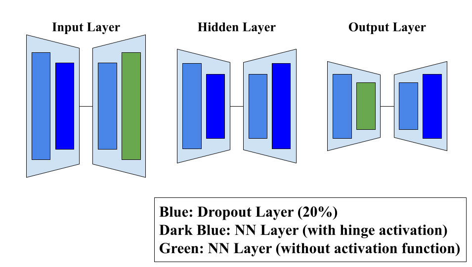
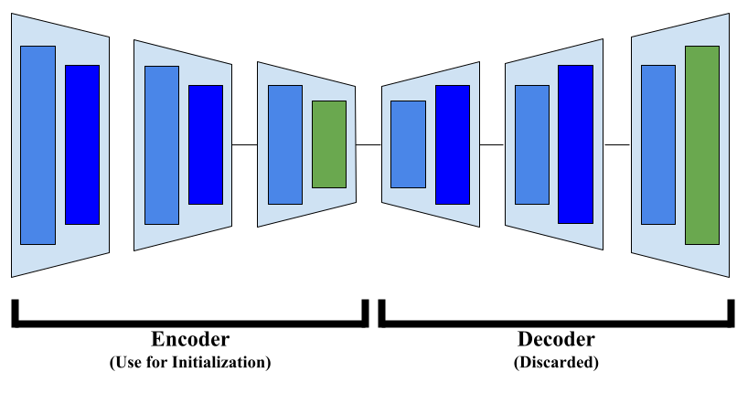
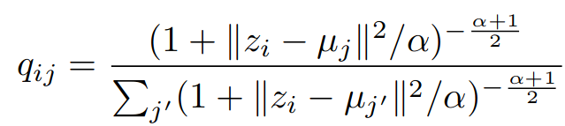
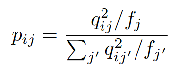
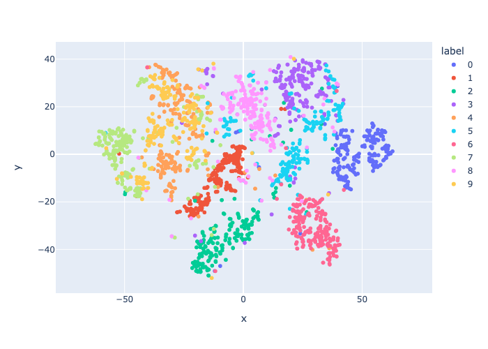
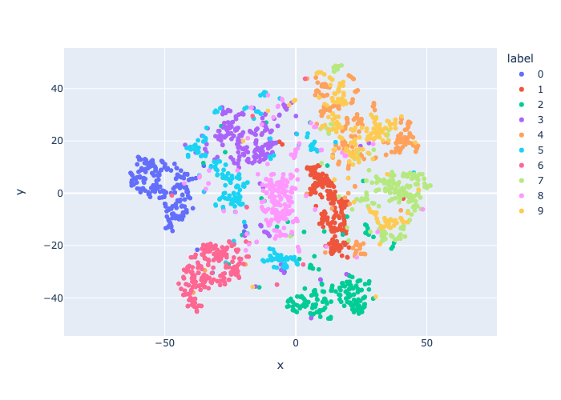
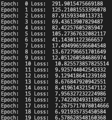

## What?
Deep Embedded Clustering (DEC) is a method that jointly learns cluster centroids for Lloyd’s Algorithm for the KMeans problem and a non-linear re-representation of the data in a reduced dimension; i.e., it combines dimensionality reduction with clustering, two tasks that are usually applied sequentially. It was introduced in 2016 (and hence why this post is a bit too late) in the paper “Unsupervised Deep Embedding for Clustering Analysis (Junyuan Xie, Ross Girshick, Ali Farhadi)” (link to the paper at the end of the post in Resource List) 

I happened to learn about DEC because I took a shot at reimplementing the model from scratch, and I decided to write a post on DEC to talk about how DEC works and the results I got contrasted with the results the paper mentions they obtained. My code can be found [here](https://github.com/narutatsuri/deep_embedded_clustering) (be careful, I did not comment some parts yet...)

## Why?
The motivation behind combining the two tasks is this: Say you want to do some form of clustering on your data. Regardless of of the algorithm you choose, the notion of dissimilarity must exist and the representation of your data must be “good” in the sense that points you want assigned to the same cluster should be similar in terms of distance and vice versa. 

Of course, clustering is unsupervised so the user can judge whether a representation is good by, for instance, quite literally eyeballing the resulting clusters and seeing whether the points that are together match your intuition or not. 

One way to do this would be to apply some form of metric learning, where you attempt to re-represent your data so that your data fits this notion of “good.” 

But you can only tell whether your metric learning shenanigans are applicable or not if you have a labeled dataset because then you can tell whether the points you want to be close to each other are actually close or not. 

The issue in the unsupervised learning case is you don’t have labels! Yes, you can eyeball it, but that becomes difficult when you have a lot of data points. What do you do?

Deep Embedded Clustering (DEC) talks about one way to tackle this problem, and the concept itself is nothing super flashy. 

The idea is something akin to unsupervised metric learning where the “unsupervised” part is the clustering part and the “metric learning” part is the dimensionality reduction part. Both tasks in itself are not difficult; the novel part is how they connect the two to make a functioning model.

## How?
In a nutshell, DEC operates as follows:

1. Start off with an initial re-representation of your original data in a space with less dimensions, which is obtained in a non-linear fashion using a DNN. 

2. Apply clustering to your re-represented data. In their specific instance, they use Lloyd’s Algorithm. Now you have cluster centroids and a re-representation; you need a way to figure out how good the re-representations are. 

3. Uses a magical way to judge whether this re-representation is good or not (which we will talk about later)

4. Adjust the re-representation and update the DNN that produced this representation and adjusts the cluster centroids for the clustering part. 

5. Repeat 1~4 until satisfactory.

As we mentioned, the parts that are special about DEC is mainly two parts: how they obtain the initial embeddings (A big plot hole in the model is that the initial embeddings are not random but rather start off very well; we’ll talk about this later), and how they magically compute goodness of embeddings and cluster assignments. The rest either follow the above two or are just traditional methods.

### Step 1. 
They use a Stacked Autoencoder (SAE) in a certain way, which as the name suggests, is a model that stacks multiple autoencoders together.

The reason why they specifically use SAE is based on previous papers such as “Stacked denoising autoencoders: Learning useful representations in a deep network with a local denoising criterion” (Vincent, Pascal, Larochelle, Hugo, Lajoie, Isabelle, Bengio, Yoshua, and Manzagol, Pierre-Antoine). There’s no formal mathematical proof to back them up; they’re purely based on empirical results.

Below is a generalized diagram:

{width=50%}

We first construct each autoencoder individually and train them on our dataset with the purpose of reconstruction. Out of the autoencoders, we denote two of them as special ones and call them input and output layers. The name is because, as the name suggests, when we stack the autoencoders up the input layer is the first layer and the output is the last layer; this isn’t a very accurate description, but the below diagram is what the SAE would look like: 

{width=50%}

We take apart each autoencoder into its encoder and decoder part, and stack the encoder and decoder parts and stick them together at the end. We then retrain the stacked model again with our dataset. 

After this, we only keep the encoder part and throw away the decoder part. This encoder part is the DNN part that we use to re-represent our original data in the embedded space.

### Step 2. 
We now pass our data through the DNN (the encoder of the SAE) and obtain our initial embeddings. Now, we apply clustering to the re-represented data. 

There’s nothing much to write about this step; we apply clustering for the KMeans problem and we obtain cluster centroids. How we determine $K$ is entirely up to the user’s intuition as per the traditional KMeans problem.

### Step 3.
This is the special part. 

If the reader is familiar with the t-SNE method for data visualization, the idea behind t-SNE is to learn a distance converted to probability distribution around each point, i.e. for each point, based on the distance of the points around it, we model a point density distribution (and the weight of each point based on its distance can be adjusted by the user) and the idea is to reconstruct this density distribution as accurately as possible for each point in the re-represented space.

Why t-SNE is only used for data visualization instead of actually using the embedded points for tasks is because t-SNE preserves local structure; there’s no guarantee that global structure is preserved. Meaning, the distance relationships between points is not explicitly preserved and thus not guaranteed to be reflective of the actual dataset. But that’s for another time.

The authors draw inspiration from t-SNE. The idea is to define a soft cluster assignment $q_{ij}$ where $i$ is the data point and $j$ is the cluster label (meaning how likely $i$ is going to be assigned to $j$ given the current representation) and a hard cluster assignment $p_{ij}$ for each point. 

I couldn’t get myself to LateX the equations and instead decided to approximate with pictures:

{width=50%}

{width=30%}

$z_i$ is the re-represented data point in the embedding space ($z$ is used by notation convention of autoencoders) and $\mu_j$ is the cluster centroids. These are both vector representations, so $||z_i-\mu_i||^2$ is the L2 norm squared, i.e. the Euclidean distance between data point and cluster centroid. 

The expression for $q$ is precisely the Student’s t distribution; while $\alpha$ can be adjusted as a hyperparameter, the authors of DEC set it to 1 as the original t-SNE paper does so. 
$p$ is essentially a normalized version of $q$. 

Essentially, they are bootstrapping on the initialization and improving by iteration; the idea is that they want $q$ and $p$ to be close to each other as possible. 

Now, the expressions for these are, in a way, completely arbitrary; this isn’t the only way to accomplish the same goal. 

Personally, I was confused for a while on how these expressions are justified and how they actually lead to good re-representations when I read the paper. But these are modeling assumptions made by the author, and they are justifying it empirically by showing their results (which, to skip ahead, I was not able to replicate their results, but we will talk about that later).

### Step 4. 
To compare $p$ and $q$, they use standard KL Divergence (essentially, cross-entropy). Taking the partial derivative with respect to $z$ and $\mu$, we obtain the gradient and update the embeddings and cluster centroids. 

We then retrain the DNN with the updated embeddings. For the cluster centroids, we only adjust the values. 

## Additional Notes
Another way to look at DEC is that they are doing a special form of multiclass classification. 
Why? Say we use a DNN to do multiclass classification. The output of the DNN would traditionally be a multinomial probability distribution, and the class we chose for the input would be the element of the distribution with the largest value. 

In this case, we would ideally want the output of the DEC to be a one-hot vector, where the index of the class that the data point is attributed to is 1 and the rest are 0. The burden of learning this (very extreme) multinomial distribution is on the DNN. 

DEC, in a way, is reducing the burden of the DNN by allowing the outputs of the DNN to be “flexible” where it can steadily drift towards the correct answer instead of being given a harsh one-hot vector to map to.

### My Results and Thoughts
Regarding the results I obtained, 

{width=35%}{width=35%}{width=20%}

The one on the left is the initial cluster embeddings on a subset of the MNIST dataset, the middle the end result, and the rightmost is the log file of the change in KL Divergence loss.
 
When I saw the leftmost plot, instantly a question mark popped in my mind: this already looks pretty good. And indeed, it was already giving a clustering accuracy of around 70~80%. The authors mention that SAE is known to give good results, but this seems… too good. Isn’t it almost taking the job of DEC away?

Looking at the paper, there is a figure that compares KL Divergence with cluster accuracy (yes, it’s unsupvervised, but the dataset they use in this case was the MNIST dataset. Cluster labels are determined by majority vote and used to determine accuracy), which is Figure 5(f). 
The K-Means initialization is already giving 80% accuracy, and this is going up to around 85% accuracy as KL Divergence loss “converges.” 

### Testing & Debugging

So, the next logical thing to try would be to use random initialization and see what we obtain. And… it didn’t work in the least.

Left is initial embeddings applied t-SNE, right is final embeddings applied t-SNE.The KL Divergence loss was decreasing, but the accuracy for clustering hovered around a 20% without moving much. 

I also wanted to comment on their justification of how the clusters obtained from DEC are more pronounced than the initial embeddings. 

The diagram that they use to argue this point is a subsample of the dataset that they trained DEC on; i.e. they trained DEC on the entire MNIST dataset, and picked with uniform probability from each cluster a subset of points. 

It’s usually frowned upon to deduce properties of the data from a t-SNE visualization for reasons we discussed earlier, but the (implicit) justification in their paper is that if clusters are clearly divided from other clusters with margins between them, t-SNE preserves local structure so the original embeddings must also have the same property.

### Other Implementations by Other People

Of course, there were other implementations of DEC. 

I checked their accuracy and they actually seemed to be arriving at similar results as the original paper, so I thought there was an error in my code.

Taking a further look at their code, I realized that they were kind of cheating in a way. While the original paper says you’re supposed to update $z$ and $\mu$ by taking the partial derivative and yada-yada, these implementations instead update $z$ and $\mu$ so that $p$ and $q$ are explicitly getting close to each other, whereas that’s supposed to be an implicit by-product of updating $z$ and $\mu$ in the way described in the paper. While theoretically they should be equivalent, I’m not sure if this approximate way of doing so is justifiable. But the authors also claim that minimizing KL Divergence leads to the cluster division becoming more emphasized, and in this aspect their method of approximation would not exactly be cheating. 

From this, I guessed the inconsistency in my results was because of my update method for $z$ and $\mu$, as others are arriving at good results by using a different method.

### Potential Future Directions
There was a paper that directly builds on DEC (which happens to be authored by somebody who also wrote a custom implementation of DEC) talking about preserving local structure of the clusters before embedding. The idea was that while DEC tries to keep the implicit clusters that already existed in the original representation of the data and thus attempts to preserve global structure, there's no guarantee what's going on in each cluster (and it's safe to say the local structure is not preserved). They try to tackle this problem.

I'm personally interested in digging deeper into the modeling assumptions of the authors of DEC; from my personal results, I didn't obtain the results that they obtained based on their modeling assumptions. Then the question would be, what sort of construction will give satisfactory results? 

## Resource List
 - [Unsupervised Deep Embedding for Clustering Analysis (Junyuan Xie, Ross Girshick, Ali Farhadi)](https://arxiv.org/pdf/1511.06335.pdf) (Just the original paper)

## Final Notes 
I think it’s pretty common for papers that focus on implementation to seem very superficial (at least to me), especially if we look at the results section and see an amazing 0.1% increase in accuracy. 

But the real essence of papers like DEC is the novel idea behind how they try to combine dimensionality reduction and clustering to show that it’s not impossible and a potential subject to look deeper into. Also, their method of updating the points using $p, q$ is a modeling assumption they make, and we can tackle the reasonability of this assumption either by looking at the results and showing they’re good (which doesn’t talk about universal cases but is still considered useful because we at least know the algorithm works on SOME datasets), or going the hard route and showing by mathematical justification that things work out. 

Up until recently, I’ve always looked at such implementation papers with a skeptical eye (even though I’m in no position to do so) but I’m starting to be able to see the deeper and broader picture. 
