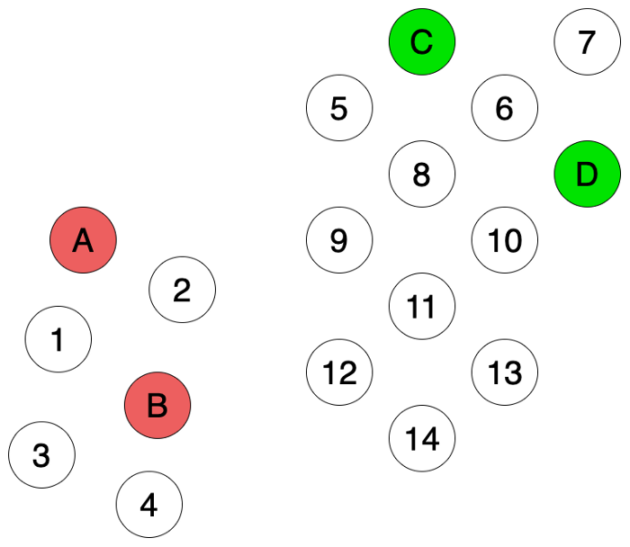
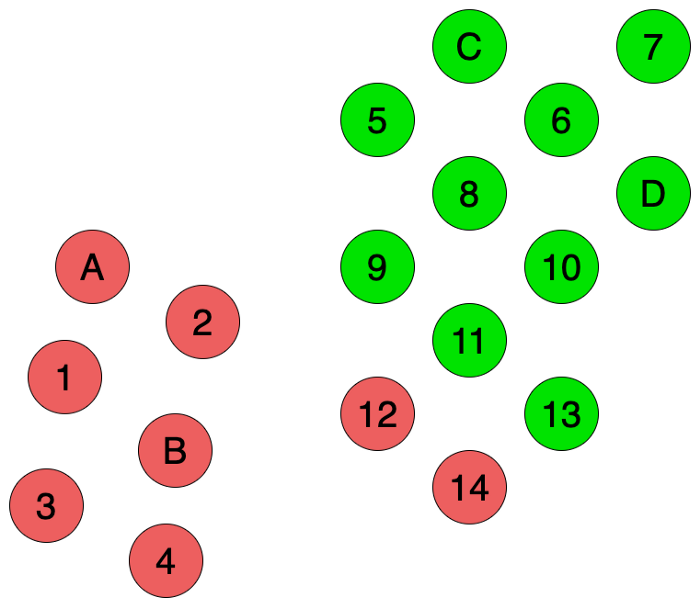
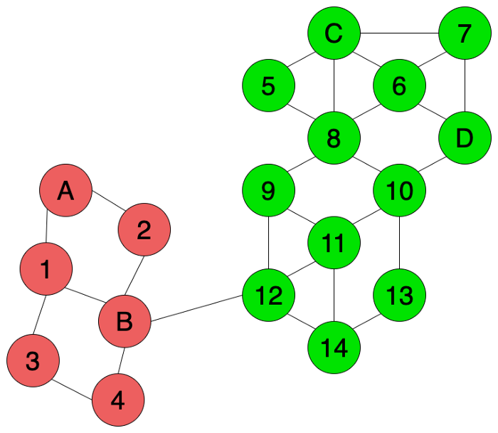

*Disclaimer: I’m no expert, not even close. *

*Also, I realized this post resulted in a very similar structure to existing posts on transduction, which is kind of sad. *

*This post will not talk about the rigorous details of transduction (thank god), maybe in a future post.*

&nbsp;

The origins of why I specifically decided to write about transduction (which seems like a topic maybe three people in the world care about, which isn’t quite true (not only in the literal sense)) is because I had an idea of combining k Nearest Neighbors and bootstrapping (in the machine learning sense, not the statistical sense, though they’re closely related idea-wise) and I happened to find a certain algorithm in transductive learning that I didn't know about. More details in the Additional Notes section.

### What?
Transduction is a method of learning (in general, not in machine learning terms of “learning”) and it’s often compared to induction. Usually, transduction is talked about in rigor in a statistical learning theory course, but let’s not go there because I don’t consider myself worthy of even atempting to explain statistical learning theory.

#### Definition
Definition-wise, according to Wikipedia (which probably explains it way better than I do), transduction is “reasoning from observed, specific (training) cases to specific (test) cases” and induction is “reasoning from observed training cases to general rules, which are then applied to the test cases.” 

In softer terms, induction is when you’re given a few data points and you try to learn a general model that fits these data points and you use this model to figure out the cases for new points you encounter. This is quite literally what supervised learning is; you’re given data points which you consider your training set, you fit a function (or more generally, a model) to it which you call, well, your model, and you predict on other data points which you call your test data. 

On the other hand, transduction uses your training set and directly predicts on your test data by using some other information present in the data you’re given. This can be something like some form of similarity metric such as pairwise Euclidean distance between data points if you assume you’re operating in Euclidean space; if your point is close to a point that’s already labeled, we assign it the same label. I know this sounds something like k Nearest Neighbors (because that’s what I thought at first too, or maybe I’m just dense I don’t know), but kNN is not a transductive learning method (but there apparently are transductive learning variants of kNN) because while it’s non-parametric it technically considers the training data as a model. Also, transduction is considered a semi-supervised learning method.

Two key differences between induction and transduction is:

 - Induction has the “learn a generalized model” step while transduction doesn’t
 - Transduction uses information present in the data and figures out a pattern

### Why?
Sure, that’s cool (and doesn’t really make intuitive sense), but WHY? 

Let’s look at the pros and cons of both transductive and inductive learning. In a nutshell, induction breaks down in some instances (and vice-versa, of course), and in some of those instances we might be able to apply transduction.

#### Pros and Cons: Transductive vs. Inductive Methods
Inductive

 - Pros
   + Once training is done, you have a model. Prediction isn’t costly (relatively to transduction) because you just apply your model to your test points.
   
 - Cons
   + Nobody said your training data is perfect. So, your model might (technically, will) have some form of bias.

Transductive

 - Pros
   + Known to have better performance in case-by-case scenarios (like the one we’ll talk about later). Intuitively speaking (my intuition, don’t trust it), transduction seems to have ironically more generalization properties than induction. When you try to fit a model to your data, you are essentially making a modeling assumption that the model you’re using is a reasonable, but how can you say your assumption is valid (which is a well-known issue in machine learning)?
 - Cons
   + Computationally expensive. When you’re given a new test data, theoretically speaking, you need to rerun the whole process again because transductive learning looks at the training and test data and considers them all when assigning labels to the test data. This means that the performance of transductive learning is terrible for things like online learning (where you have a stream of data points coming in sequentially) because you need to rerun the whole freaking process for each new point.
Your predictions are based on what you currently observer for the training and test data. So, you cannot judge points that you have not observed, meaning inference is a pain in the arse.

#### Working Example of Transductive vs. Inductive Methods
*Disclaimer: Yup, I stole this example from other resources but they just explained it too well. Sorry. Picture credits go to reference number 2.*

Let’s say you’re given the data points above (let’s ignore all the mathy details like “do we have a defined metric,” “what space are we operating in,” yada yada) .
The possible labels are Red or Green. The labeled ones are your training data and the white points are your test data that you want to color either Red or Green.

Let’s say we run a vanilla k Nearest Neighbors algorithm on the above. We get something like the below:

This doesn’t fit our intuition, because our human instincts tell us that the six points on the left should be one group (I dare not say cluster because this is supervised learning) and the rest on the right should be another group. But based on how kNN operates, this is what happens.

Now, let’s apply transduction. If we apply something called a graph-based variant of the label propagation algorithm (which we’ll talk about in the next section), we first construct a graph with all the points and then propagate the labes according to the graph we constructed by proximity, we get the below:

This looks better! 

The difference we observed here between transduction and induction is exactly what we were talking about when we mentioned modeling assumptions of the data (in this case, modeling assumptions of kNN). 

### How?
Now, we talk about two main algorithms within transductive learning. 
We talked a bit about Label Propagation in the previous section, but let’s go a bit into detail (not comprehensively, of course).

#### Label Propagation Algorithm (LPA)
LPA is a graph-based transductive learning method, so it requires us to construct a graph a priori with our data points (how you construct the graph, i.e. which nodes to connect with edges is entirely up to the user). 

The core idea behind LPA is that if two nodes are connected then they should share the same property (which makes intuitive sense). 

But then, sometimes you might not know the labels for all of the nodes connected to a particular node. 

Are you screwed? No; to circumvent this, LPA looks at the traversal probability with a random walk to a labeled node from that particular unlabeled node, or in simpler terms, LPA looks at the probabilities to arrive at all the labeled nodes from the unlabeled node (which would be high if the unlabeled node is close to a particular labeled node and vice-versa) and judges the label based on this probability and the label of the labeled node. In a way, it’s taking the expectation for the label!

We agreed to not talk about math so I won’t include it here, but the algorithm itself in pseudocode would be something along the lines of calculating the probability a particular unlabeled node is attributed to a label based on the traversal probability for all unlabeled nodes. Then, we simply take the label assigned the highest probability for each unlabeled node and we’re done. 

#### Transductive Support Vector Machines (Transductive SVM)
This part will sadly assume the understanding of the math behind SVM even though I promised no math, but I won’t put many equations in and keep the explanation short for this post (and expand the rigor maybe in a future post with math). 

The idea behind Transductive SVM is that instead of having one constraint for the optimization objective (which is on the labeled points), we also include another constraint on the unlabeled points so that the margin for the unlabeled points satisfy the constraint. 
I just realized this makes absolutely no sense without math, so I’ll leave it here as a lousy “cliffhanger” for a future post.

### Additional Notes
To talk a bit more about the origins of how I stumbled across transductive learning, I originally worked with PU Learning (Positive and Unlabeled Learning) last year on a research project and I came up with an algorithm that took inspiration from PU Learning. Turns out PU Learning and transductive learning are quite similar in its motivation, so I apparently happened to come up with a variant of LPA.

The algorithm goes like this: given a set of test points, what if we applied kNN to these test points, then iteratively bootstrapped on these test points and updated their labels depending on the labels of the closest points around them? 

I wrote some code to see how this works and compared it with vanilla kNN (which you can access here if you’re interested). I was also curious if this already existed because it seemed like a very simple idea, so I asked a question on r/MachineLearning on Reddit to see if that was the case, and some knowledgeable people pointed me in the direction of transductive learning. So, I decided to learn a bit about it and write a short post on transduction. 

### Resource List:
 - https://en.wikipedia.org/wiki/Transduction_(machine_learning)
 - https://towardsdatascience.com/inductive-vs-transductive-learning-e608e786f7d
 - https://cims.nyu.edu/~mohri/amls/aml_transduction.pdf (Not referenced in this post)
 - https://towardsdatascience.com/label-propagation-demystified-cd5390f27472
 - http://www.cs.cmu.edu/~guestrin/Class/10701-S06/Slides/tsvms-pca.pdf (Not really referenced either)

### Final Notes 
Apologies in advance if my explanations are subpar; hopefully, I’ll get better at this the more I write. 

Hopefully.

Bye!
